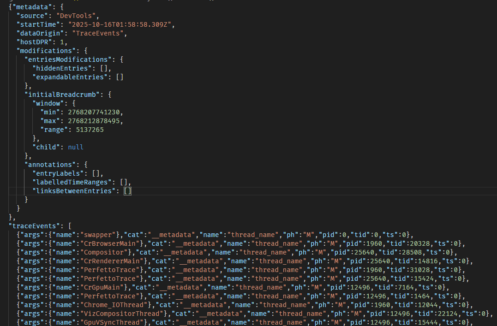

## Profiling PHP

- using Xdebug we can generate files in the [Callgrind format](https://valgrind.org/docs/manual/cl-format.html) https://xdebug.org/
- these files can be visualized using tools like KCacheGrind or QCacheGrind

callgrind files look like this:

bars

tree map

call graph

- There is also a very simple web-based viewer for cachegrind files called Webgrind

## Rust profiling 

For rust we can use `cargo-flamegraph` to generate flamegraphs https://github.com/flamegraph-rs/flamegraph

rust, and other compiled languages, performance can also be analyzed using `perf`, wich outputs data in the .perf format https://perf.wiki.kernel.org/index.php/Tutorial

## Typescript type checking performance profile

- Typescript type checking can be slow, especially in large projects
- we can use `tsc -p some_directory --generateTrace some_directory --incremental false` to get an output file that can be analysed using `chrome://tracing` in the Chrome browser. But it looks like the chrome team is not supporting this tool anymore.
- https://github.com/microsoft/TypeScript/wiki/Performance-Tracing

- the traces generated by chrome tracing are in the so called `chrome tracing format` https://docs.google.com/document/d/1CvAClvFfyA5R-PhYUmn5OOQtYMH4h6I0nSsKchNAySU/preview?tab=t.0#heading=h.yr4qxyxotyw

- typescript traces loaded in chrome tracing look like this:

## Chrome profiler

- The chrome profiler is by far the most advanced and feature rich profiler that I know of.
- It has lots of features to visualize and analyze performance data.
- The data can be exported and imported in the `chrome tracing format`

It looks like this:

the exported json data looks like this 

## General purpose profiling tools

### Perfetto

- Perfetto is a open source project by Google that provides a set of tools to collect, analyze and visualize performance data.
- It can be used to profile Android and Linux applications, and also chrome traces.
- 
https://perfetto.dev/docs/

## SpeedScope

https://www.speedscope.app/

speed scope looks like this:

